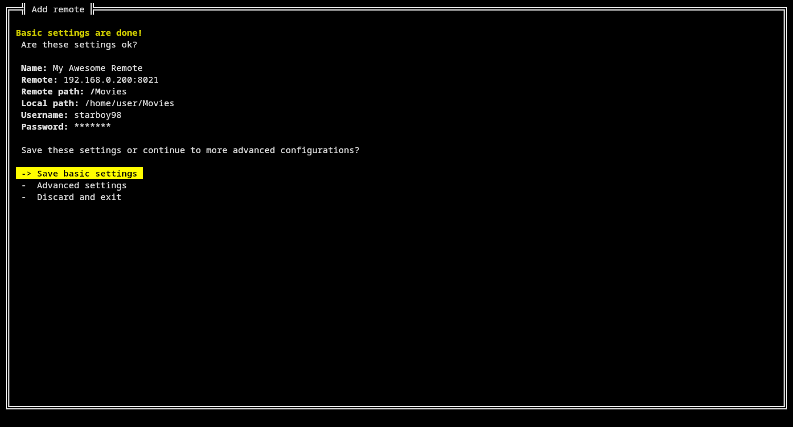

# sync-remote
sync-remote is a utility for syncing FTP directories (refered as remotes) and local directories in both directions.

- You will have identical copies of the directories in the remote and in your local machine. Files modified in one place will be copied to the other.

- sync-remote relies on the modified date of the file, so files with an older modified date will be overwritten with the more recent version.

- To prevent data loss, before any syncing is done, a backup of the local directory will be made (this can be disabled if you want).

- Ideal for syncing data between two devices (like, a laptop and a desktop) and a FTP server.

	- For example: Syncing saves of games between these two devices!

